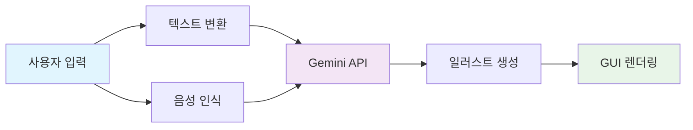

<div align="center">

# 🌟 어린이 그림일기 도우미

**AI와 함께 만드는 마법 같은 그림일기 경험**

<br>

[](https://python.org)
[](https://ai.google.dev)

<br>

```
   🎨 텍스트 입력  →  🤖 AI 변환  →  ✨ 그림 생성
```

*말하거나 적은 내용을 아이들만의 특별한 그림일기로 변환해주는 스마트 도구*

</div>

---

## 🚀 **주요 기능**

<table>
<tr>
<td width="50%">

### 📝 **스마트 텍스트 변환**
일상 언어를 5-13세 아이들이 쓰기 좋은  
그림일기 문체로 **자동 변환**

### 🎨 **AI 일러스트 생성**  
지브리 스타일의 동화 같은  
**맞춤형 일러스트** 즉시 생성

</td>
<td width="50%">

### 🎙️ **음성 인식 지원**
마이크로 말하면 바로  
**텍스트 + 그림** 동시 생성

### ⚙️ **개인화 옵션**
아이 성별, 스타일 등  
**세부 설정** 가능

</td>
</tr>
</table>

---

## ⚡ **Quick Start**

<div align="center">

### 🔧 **설치 (30초 완료)**

</div>

```bash
# 📦 프로젝트 복제
git clone https://github.com/your-username/SW_ThemePark-1.git
cd SW_ThemePark-1

# 🛠️ 의존성 설치
pip install -r requirements.txt

# 🔑 API 키 설정
echo "GEMINI_API_KEY=your_api_key_here" > .env

# 🚀 실행
python main.py
```

<div align="center">

### 🎯 **3단계 사용법**


</div>

---

## 🧠 **학습 하이라이트**

<div align="center">

| 🎯 **핵심 역량** | 📈 **기술 스택** | 🔬 **구현 포인트** |
|:---:|:---:|:---:|
| **멀티모달 AI** | Gemini 2.0 Flash | 텍스트+이미지 동시 생성 |
| **GUI 디자인** | CustomTkinter | 반응형 레이아웃 설계 |
| **프롬프트 엔지니어링** | LLM Prompting | 연령별 맞춤 프롬프트 |
| **음성 처리** | SpeechRecognition | STT → 이미지 파이프라인 |

</div>

<details>
<summary><b>🔍 상세 학습 내용 보기</b></summary>

<br>

**🤖 AI 통합 개발**
- Gemini API의 멀티모달 응답 처리 로직 구현
- 실시간 텍스트-이미지 생성 파이프라인 구축

**🎨 사용자 경험 설계**  
- 어린이 친화적 UI/UX 패턴 연구 및 적용
- 색상 심리학을 활용한 인터페이스 디자인

**⚡ 성능 최적화**
- 이미지 바이트 스트림 효율적 처리
- GUI 스레드 블로킹 방지 비동기 패턴

</details>

---

## 🛠️ **기술 아키텍처**

<div align="center">



</div>

<div align="center">

### 🏗️ **Tech Stack**


</div>

---

## 🎓 **교육적 가치**

<table>
<tr>
<td align="center" width="25%">
<br>
<b>상상력 자극</b><br>
<small>아이디어를 시각화하는<br>창의적 사고 개발</small>
</td>
<td align="center" width="25%">
<br>
<b>표현력 향상</b><br>
<small>일상 언어를 문학적<br>표현으로 발전</small>
</td>
<td align="center" width="25%">
<br>
<b>AI 리터러시</b><br>
<small>차세대 기술과의<br>자연스러운 상호작용</small>
</td>
<td align="center" width="25%">
<br>
<b>가족 유대</b><br>
<small>부모-자녀 간<br>창의적 협업 도구</small>
</td>
</tr>
</table>

---

## 🎪 **데모 & 예시**

<div align="center">

### 📸 **변환 예시**

| **입력** | **출력** |
|:---:|:---:|
| *"오늘 학교에서 친구와 축구했어"* | *"오늘 학교 운동장에서 친구랑 축구공을 차며 뛰어다녔어요. 골을 넣었을 때 정말 기뻤어요!"* |
| *"비가 와서 집에 있었다"* | *"비가 주룩주룩 내려서 창밖을 보며 집에서 놀았어요. 빗소리를 들으니 마음이 차분해졌어요."* |

### 🎨 **생성되는 일러스트 스타일**
- 🌈 **지브리 애니메이션** 감성의 따뜻한 색감
- 👦👧 **성별 맞춤형** 캐릭터 자동 생성  
- 🏞️ **동화적 배경** 몽환적이고 부드러운 분위기

</div>

---

## 🔧 **문제 해결**

<details>
<summary><b>⚠️ 자주 발생하는 문제들</b></summary>

<br>

**🔴 PyAudio 설치 실패 (Windows)**
```bash
pip install pipwin
pipwin install pyaudio
```

**🔴 API 키 인식 오류**
- `.env` 파일이 프로젝트 루트에 있는지 확인
- API 키가 `AIza...`로 시작하는지 확인

**🔴 음성 인식 실패**
- 마이크 권한 확인
- 조용한 환경에서 명확한 발음으로 테스트

</details>

---


<div align="center">

## 💝 **Special Thanks**

이 프로젝트는 **아이들의 무한한 상상력**에서 영감을 받았습니다

<br>

[](.)
[](../../issues)
[](../../issues)

<br>


<sub>ai daiary</sub>

</div>
